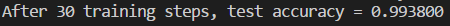
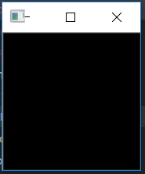
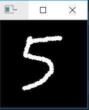
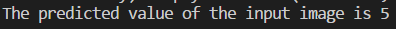
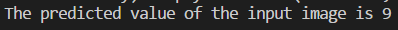

## part 1. Introduction

Implementation of a simple pipeline for training mnist in Tensorflow (TF-Slim).<br>
- [x] A simple neural network architecture.
- [x] Basic working demo
- [x] Training pipeline
- [x] Draw number for test
- [x] Test your custom image

The network architecture shows that I am free to set up, you can modify it according to your needs.

## part 2. Quick start
1. Clone this file
```bashrc
$ git clone https://github.com/po1234263/TFslim-mnist.git
```
2.  You are supposed  to install some dependencies before getting out hands with these codes.
```bashrc
$ cd TFslim-mnist
$ pip install -r ./docs/requirements.txt
```
3. We provide our pretrained `.ckpt` files in the dir `./tmp`, and you can run the `test.py` script to get the information below.
```bashrc
$ python test.py
```

## part 3. Train by yourself
#### how to train it ?
```bashrc
$ python train.py
$ tensorboard --logdir=your_log_path
```
Our program provides some parameters to enter, you can see the meaning of each parameter in `train.py`.
As you can see in the tensorboard, if you train for too long, the model starts to overfit and learn patterns from training data that does not generalize to the test data.
## part 4. Draw some picture for testing
I have provided a simple drawing program written using opencv-python, so if you want to fully use the functions I have provided, be sure to install opencv-python.
#### how to use it ?
```bashrc
$ python draw_number.py
```
When you execute this program, a canvas will pop up, then you can draw a number you like.<br>


<br>After you finish drawing the numbers, click the `q` key in the canvas window and the program will save your drawing to `./image_set`.
At the same time, the program will predict the numbers you draw, and show the result in the terminal.<br>

## part 5. Input picture for testing
If you don't want to draw your own pictures, you can directly input a image into our network for prediction.
We have provided three pictures in `./image_set` for testing, you can just run the code below for seeing the prediction result.
#### how to use it ?
```bashrc
$ python test_for_input.py --TEST_IMG=image_set/img_1.jpg
```

